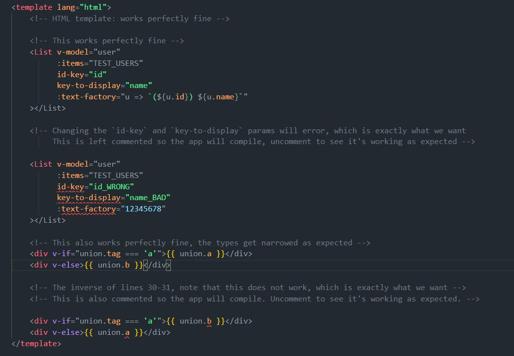

# vue-tsc-pug-repro

## This is a reproduction based off `pnpm create vue@latest`

### Reproduction steps:

```
git clone https://github.com/Threebow/vue-tsc-pug-repro
cd vue-tsc-pug-repro
pnpm install
pnpm type-check
pnpm dev
```

### Observe plenty of errors in the HTML template (as expected)


### Observe no pug errors in the pug template (not expected, there should be many):


### Typecheck and build the app, note no compile time errors, yet many runtime errors


### Check package.json to see versions of all IDE and Vue tooling is the latest -- v2.1.4
